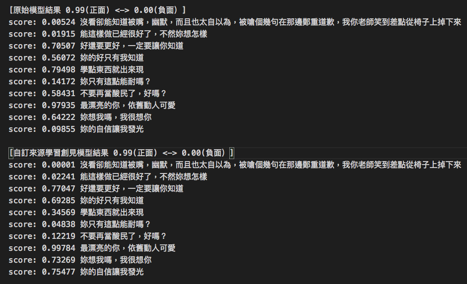
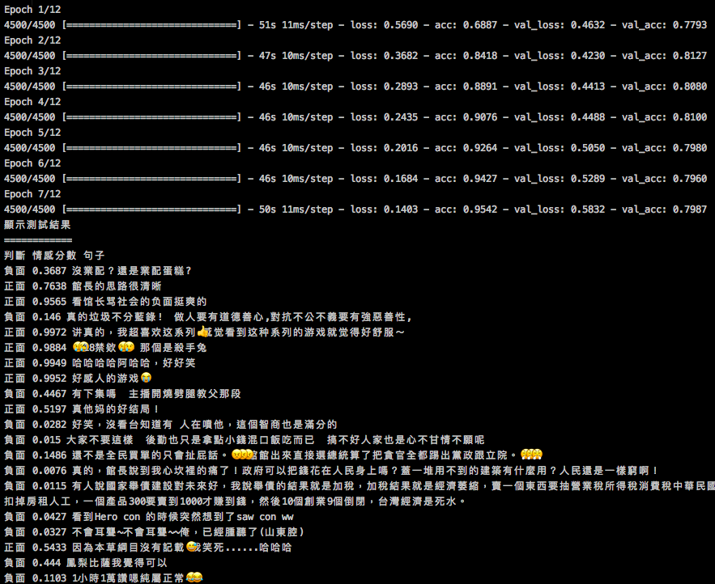

# 媒體數據來源請趕分析 Media - NLP
## 開發說明
由於Snownlp的中文情緒分析是依照酒店的回應訊息來源作建模，其效果是乎不佳，所以立此專案依照現有的社群媒體的回應訊息來進行貝葉斯演算法建模。

## ShowNLP訓練過程
我們使用原始的snownlp引擎對現在社群的50萬筆回應訊息進行分類

1. 先對50萬的訊息先進行篩選，字句長度需大於8個字與小魚150個字才納入分析
2. 然後進行sentiment 分析，sentiment 分數高於0.85分類誠正評，小於0.15分類成負評
3. 經執行結果正負評共獲取正負評各7萬個訊息詞句。

然後依照此正負評詞進行模型訓練

得出以下結果,有達精準度提昇之效果

## LSTM模型訓練
使用SnowNLP分類的節管文檔進行LSTM模型訓練
1. 我們使用Keras來進行編碼
2. 使用Jieba分詞
3. LSTM部分暫時使用一般參數設定
4. 使用python 2語言版本

結論：
可是訓練出結果不如SnowNLP的效果，尤其是訓練樣本數增加反而效果越差，可能需要微調參數，這部份持續研究中。
由於現在還是SnowNLP的Beyas謝果較優，所以以SnowNLP的模型為主要情感分析的使用模型。

